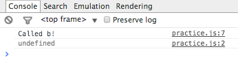
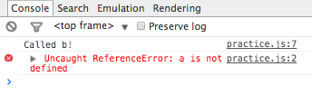
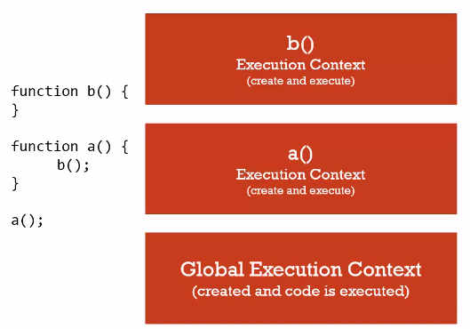
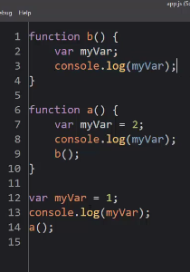
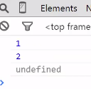

# Javascript Understanding the Weird Parts

## Conceptual Side
1. Syntax Parsers:
> A program that reads your code and determines what it does and if its grammar is valid

1. Lexical Environments:
> Where something sits physically in the code you write.

1. Execution Contexts:
> A Wrapper to help manage the code that is running.

1. Name/ Value Pairs:
> A name which maps to a unique value. The name may be defined more than once, but only can have one value in any given context.

  ``Address = '100 Main St``

1. Object:
> A collection of name value Pairs

1. Javascript and 'Undefined':
> A special value that Javascript has within it internally that means the variable has not been set. A key word that takes up memory.

  example:
  ```
  var a,
  console.log(a);
  ```
1. Single Threaded:
> One command at a time. Under the hood of the browser, maybe not.

1. Synchronous: (similar to Single Threaded)
> One at a time executes in the order that it appears.

## The Global Environment and the Global Object
1. Two things are always created when execution context is created: **'Global object'= window object when ran in the browser**, **'variable = this' which is equal to the global object**.
``
test out in console of browser. if you attach an empty js file to an html file, then type this in the console you will see a window object.
```
**Global** = "not inside a function"
1. In Javascript when you are creating variables and functions where those variables are not inside of a function, they end up being attached to the global object.
1. **Outer Environment** is null at the global level.

## The Execution Context: Creation and 'Hoisting'
1. Hoisting Examples:

```
var a = "Hello World"

function b() {
  console.log('Called b!');
}
b();
console.log(a);
```

Results:

```
b();
console.log(a);
var a = "Hello World"

function b() {
  console.log('Called b!');
}
```
Results:

```
b();
console.log(a);

function b() {
  console.log('Called b!');
}
```
Results:


### What is Hoisting?
> Most languages read line by line... Javascript doesn't do that (as you can see in examples above for the function).

### *Note*
**ALL VARIABLES** in Javascript are initially set to **undefined**, and **FUNCTIONS ARE** sitting **in memory in their entirety**.

### Execution context is created in two phases:
1. Creation Phase
  - Global Object
  - 'this'
  - Outer Environment
  *Setup **Memory Space** for Variables and Functions 'Hoisting' it is not moving code to the top of the page*
1. Execution Phase
  - Runs code line by line, once the creation phase is complete.

## Function Invocation and The Execution Stack
>**Invocation:** running a function. In Javascript this is done using parenthesis ()

- Stack is created in this example:


## Functions, context, and variable Environments
>**Variable Environments:** where the variables live and how they relate to each other in memory

Example:

Results:

- Each of the myVars is sitting in its own execution context.
