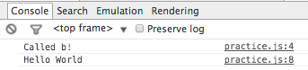
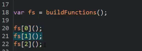

# JAVASCRIPT UNDERSTANDING THE WEIRD PARTS

# Section: 1 - Getting Started

## Conceptual Side
1. **Syntax Parsers:**
> A program that reads your code and determines what it does and if its grammar is valid

1. **Lexical Environments:**
> Where something sits physically in the code you write.

1. **Execution Contexts:**
> A Wrapper to help manage the code that is running.

1. **Name/ Value Pairs:**
> A name which maps to a unique value. The name may be defined more than once, but only can have one value in any given context.

  ``Address = '100 Main St``

1. **Object:**
> A collection of name value Pairs

1. **Javascript and 'Undefined':**
> A special value that Javascript has within it internally that means the variable has not been set. A key word that takes up memory.

  example:

  ```
  var a,
  console.log(a);
  ```

1. **Single Threaded:**
> One command at a time. Under the hood of the browser, maybe not.

1. **Synchronous:** (similar to Single Threaded)
> One at a time executes in the order that it appears.

1. **Callback Function**
> A Function you give to another function, to be run when the other function is finished. So the gunciton you call (i.e. invoke), 'calls back' by calling the function you gave it when it finishes.

1. **Function Currying**
> Creating a copy of a function but with some preset parameters. Very useful in mathematical situations.

# Section: 2 - Execution Contexts and Lexical Environments

## The Global Environment and the Global Object
- Two things are always created when execution context is created: **'Global object'** = window object when ran in the browser, **'variable = this'** which is equal to the global object.

*test out in console of browser. if you attach an empty js file to an html file, then type this in the console you will see a window object.*

**Global** = "not inside a function"
1. In Javascript when you are creating variables and functions where those variables are not inside of a function, they end up being attached to the global object.
1. **Outer Environment** is null at the global level.

## The Execution Context: Creation and 'Hoisting'
1. Hoisting Examples:

```
var a = "Hello World"

function b() {
  console.log('Called b!');
}
b();
console.log(a);
```

Results:


```
b();
console.log(a);
var a = "Hello World"

function b() {
  console.log('Called b!');
}
```

Results:


```
b();
console.log(a);

function b() {
  console.log('Called b!');
}
```

Results:


### What is Hoisting?
> Most languages read line by line... Javascript doesn't do that (as you can see in examples above for the function).

### *Note*
**ALL VARIABLES** in Javascript are initially set to **undefined**, and **FUNCTIONS ARE** sitting **in memory in their entirety**.

## Execution context is created in two phases:
1. **Creation Phase**
  - Global Object
  - 'this'
  - Outer Environment
  *Setup **Memory Space** for Variables and Functions 'Hoisting' it is not moving code to the top of the page*
1. **Execution Phase**
  - Runs code line by line, once the creation phase is complete.

### Function Invocation and The Execution Stack
>**Invocation:** running a function. In Javascript this is done using parenthesis ()

- Stack is created in this example:


### Functions, context, and Variable Environments
>**Variable Environments:** where the variables live and how they relate to each other in memory

Example:

Results:
[img](images/scopeChain2.png)
- Each of the myVars is sitting in its own execution context.

## The Scope Chain


Javascript does something special... it cares about the lexical environment when it comes to the outer reference that every execution context gets (*outer environment in creation phrase*). When you ask for a variable while running a line of code inside any particular execution context, if it can't find that variable it will look at the outer reference and go look for variables there. Somewhere down below it in the execution stack. And that outer reference where that points is going to depend on where the function sits **lexically**.
Now this entire act of searching for references to **outer environments** is called **THE SCOPE CHAIN**

| EXAMPLE                        | RESULTS                        |
|:------------------------------:|:------------------------------:|
|       |       |
|       |       |
|       |       |

### Scope :
> where a variable is available in your code... and if it's truly the same variable, or a new copy

### ES6 (ECMAScript 6, ECMAScript 2015):
> **let** allows Javascript engine to use block scoping. Similar to **var**... more options of how to scope a variable with the new version of Javascript.

> blocks are within {}

## What about asynchronous callbacks?
- **asynchronous:** more than one at a time
- Although the Javascript Engine is synchronous, there are other engines within the browser that Javascript has hooks to them to make them asynchronous
- **Event Queue**: where all events are held, such as http request, click event, etc. This doesn't get looked at until the **stack** is empty.
- The event queue won't be processed until the execution stack is empty, until Javascript is done reading that code line by line. **So it isn't REALLY asynchronous.** What is happening is that the browser asynchronously is putting things into the event queue.

# Types and Operators
 ## Types and Javascript:
 ### **Dynamic Typing**: you don't tell the the engine what type of data a variable holds, it figures it out while your code is running. *(variables can hold different types of values because it's all figured out during execution)*

 Languages like Java or C#, they use something called **Static Typing** which means you tell the engine (compiler) ahead of time what kind of data you intend to hold inside a variable. Example: You might have a keyword like bool to say that this variable should hold a Boolean value, either true or false, and if you try to put a value that is other than a Boolean into that variable, you get an error... **JAVASCRIPT is NOT like that (Dynamic Typing)** You can change the bool to a string or number or whatever.

 ## Primitive Types - 6 total (type of data that represents a single value - not an object)
 - **Undefined** represents lack of existence (you shouldn't set a variable to this)
 - **Null** represents lack of existence (you can set a variable to this)
 - **Boolean** true or false
 - **Number** floating point number (there's always some decimals). Unlike other programming languages, there's only one 'number' type... and it can make math weird.
 - **String** a sequence of characters (bother ' and " can be used)
 - **Symbol** Used in ES6 (the next version of Javascript)

## Operators
- A special function that is syntactically (written) differently *Generally, operators take two parameters and return one result.*
- The operators are functions within Javascript
- **Infix Notation** the ability to write code as 3 + 4 vs +(3,4)... the addition side is inbetween the parameters. **Prefix notation** is + 3 4; and **Postfix notation** is 3 4+; (alot of old scholl calculators work this way)

**operators** + - > < * / % << >> >>> <= >= and soo many more...

## Operator Precedence and associativity
- **Operator Precendence** which operator function gets called first. Functions are called in order of precedence (higher precedence wins)
- **Associativity** what order operator functions get called in: left-to-right or right-to-left. When function have the same precedence

[Click here to see Operator Precedence]( https://developer.mozilla.org/en-US/docs/Web/JavaScript/Reference/Operators/Operator_Precedence.compiler)

##FRAMEWORK ASIDE
- To fix colliding libraries you can write (angular and jquery maybe?):
``
window.libraryName = window.libraryName || "Lib 2";
``

# OBJECTS AND FUNCTIONS
## Objects and the Dot
- Name/ Value pairs
- Primitive "property"
- Object "property"
- Function "method"

## computer member access operator > '[]'
```
var person = new Object();
person["firstname"] = "Tony";
person["lastname"] = "Alicea";

var firstNameProperty = "firstname";

console.log(person);
console.log(person[firstNameProperty]);

//faster to type after the "." is 'searching' for a string/property with that name= 'firstname'
console.log(person.firstname);

//create an object in an object
person.address = new Object();

//create an property on the most inner object
person.address.street = "111 Main St.";
person.address.city = "New York";
person.address.state = "NY";
//prefered
console.log(person.address.state);
//not recommended, but works the same way
console.log(person.["address"]["state"]);
```

## Object and Object Literals
- Object Literals (much faster to write) is the curly braces = {}
```
//assumes creating an object
var person = {};
console.log(person);

//below are the same thing
var person = {
  firstname: 'Tony',
  lastname: 'Alicea',
  address: {
    street: '111 Main St',
    city: 'New York',
    state: 'NY'
  }
};
console.log(person);

person = new Object();
person.firstname = "Tony";
person.lastname = "Alicea";

function greet(person) {
  console.log('Hi ' + person.firstname);
}

greet(Tony);

greet({
  firstname: 'Mary';
  lastname: 'Doe'
});

Tony.address2 = {
  street: '333 Secont St.'
}
```

### Javascript doesn't have namespaces (we can fake them)
1. **NameSpace**: A container for variables and functions. Typically to keep variables and functions with the same name seperate
```
var greet = 'Hello!';
var greet = 'Hola!';

console.log(greet);

var english = {};
var spanish = {};

english.greet = 'Hello!';
spanish.greet = 'Hola!';

console.log(english);
```

## JSON (JavaScript Object Notation)
- Not the same as object literal notation, but it is inspired by it and looks very similar to it
```
var objectLiteral1 = {
  firstname: 'Mary',
  isAProgrammer: true
}

console.log(objectLiteral);

//back in the day XML syntax (longer download times)
<object>
  <firstname>Mary</fistname>
  <isAProgrammer>true</isAProgrammer>
</object>

//anything that is JSON, expects the properties to be wrapped in quotes
//JSON is technically a subset of the object literal syntax. Meaning that anything that is JSON valid is also valid JavaScript object literal syntax. But not **ALL**

object literal syntax is valid JSON (JSON is more strict and puts quotes around property names)
{
  "fistname" : "Mary",
  "isProgrammer" : true
}

//can call to convert object literal to JSON
console.log(JSON.stringigy(objectLiteral1));

//and call JSON.parse to convert to object literal
var jsonValue = JSON.parse('{ "firstname": "Mary", "isAProgrammer": true }');

console.log(jsonValue);

```

## Functions are Objects

1. **First Class Functions** = Everything you can do with other types you can do with functions. Assign them to cariables, pass them around, create them on the fly.

1. Function = a special type of object... you can attach the same things you can attact to an object such as: "Primitive, Object, Function" can have the following properties: "Name(optional can be anonymous), and CODE(invocable- meaning that you can say run this code sitting on that property"

## Function Statements and Function Expressions
1. **Expression** - a unit of code that results in a value. It doesn't have to save to a variable.
examples:
```
a = 3;
$ 3
1 + 2;
$ 3

//if is a statement and expression results in value
if (a === 3) {

}

//function statement - this gets hoisted to the top... so you can call the function earlier then when it's defined
greet();

function greet() {
  console.log('hi');
}

//this function is considered an expression because it is set to to a variable, ends up being hoisted as an annoynoumous function until it is read inline.

var anonymousGreet = function() {
  cosole.log('hi');
}

anonymousGreet();
```
1. First class function : you can create a function on the fly (similar to object literal)
```
function log(a) {
  a();
}
//invoke code within another code.
log(function () {
  console.log('hi');
});
```
- **FIST CLASS FUNCTIONS introduces FUNCTIONAL PROGRAMMING**
>this concept of first class functions then, where you can pass functions around, give functions to other functions use them like you do variables, introduces an entirely new class of programming, called **functional programming**

## Conceptional aside by VALUE vs by REFERENCE
- both cases we are talking about variables
```
//by value (primitives)
var a = 3;
var b;
// be is only a copy of a and has it's own space in value
b = a;
a = 2;

results (b = )

// by reference (all objects (including functions))
var c = { greeting: 'hi' };
var d;

d = c;
c.greeting = 'hello'; //mute (means to change something - 'immutable' means it can't be changed)

console.log(c);
console.log(d);

//this poits to same location in memory
c = $ {greeting: 'hello'}
d = $ {greeting: 'hello'}

```

## Types of ways to create and invoke functions:
```
//fuction statement
function statement () {
  console.log('I am a statement');
}
statement();

//function expression
var expression = function() {
  console.log('I am an expression');
}
expression();

//IIFE = Immediately Invoked Function Expressions
var expression = function() {
  console.log('I am an expression');
}();

var greeting = function(name) {
  return 'Hello' + name;
}('John');

console.log(greeting);
```

## Understanding Closures (Part 1)
1. To start with we're going to write a bit of code to show the power of closures then go under the hood to understand them.
- **CODE**
```
function greet(whattosay) {
  return function(name) {
    console.log(whattosay + ' ' + name);
  }
}

//1.
greet('Hi')('Tony');

$ Hi Tony

//2.
var sayHi = greet('Hi');
sayHi('Tony')

$ Hi Tony
```
- **UNDER THE HOOD**
* 1st when the code starts we have our Global Execution Context. When I hit this line ``sayHi = greet`` it invokes the greet function, the new execution context is created. And the variable that's passed to it, ``whattosay``, is siting in its variable environment. It returns a new function object. It creates a function on the fly, and returns it. And that's it.


* So after that return, the greet execution context is popped off the stack. It's gone. But here's a question... We said every execution context has this space in memory, where the variables and functions created inside of it live. What happens to that memory space when the execution contect goes away? Well under normal circumstances, the JavaScript engine would eventually clear it out with a process called garbage collection. But at the moment that execution context finishes, that memory space is still there. The execution context may be gone but it's just sitting there somewhere in memory.


* All right, now we move on and we're inside the global execution context again. And then we invoke the function that sayHi is pointing at. It's an anonymous function, because we didn't give out function a name when we returned it.


* And then that creates a new execution context. And I've passed the name variable, Tony. So that will end up in its memory. So that will end up in its memory.


* But when I hit this line, console.log. When its code is invoked and JavaScript engine sees the ``whattosay`` variable, what does the JavaScript engine do? Well it goes up the scope chain. There's an outer lexical environment reference. In other words it goes to the next point outside where the function was created to look for that variable, since it couldn't find it inside the function itself.


* And even though the execution context of that function greet is gone, was popped off the stack, the sayHi execution context still has a reference to the variables, to the memory space of its outer environment. In other words, even thought the greet function ended, it finished, any function created inside of it when they are called will still hae a reference to that greet function's memory. To what was in its memory, its execution context memory space. Think about this for a second. Greet is gone, the execution context is gone. But what's in memory for that execution context isn't and the JavaScript engine makes sure that my function can still go down the scope chain and find it. Even though it's not even on the execution stack anymore.


* And this way we say that the execution context has closed in its outer variables, the variables that it would normally have reference to anyway. Even though those execution contexts are gone. And **so this phenomenon, of it closing in all the variables that it's supposed to have access to, is called a closure.** Makes sense? It isn't something, then, that you create, that you type, that you tell the JavaScript engine to do.


* Closures are simply a feature of the JavaScript programming language. They just happen. It doesn't matter when we invoke a function. We don't have to worry if its outer environments are still running. The JavaScript engine will always make sure that whatever function I'm running, that it will ave access to the variables that it's supposed to have access to. That its scope is intact. Makes sense? This is a feature of the language that's extraordinarily important and powerful. We rely on it a lot. It allows us to make some really interesting coding patterns. And understanding what's happening under the hood helps us to understand closures aren't all that complicated. They're just a feature to make sure that, when you run a function, it works the way it's supposed to,; that it has access to those outer variables. It doesn't matter whether the outer functions have finished runnign or not. So when you say, oh I create a closure. Well sort of. You'll read that sometimes, I create a closure. The JavaScript engine creates the closure. We're just taking advantage of it.

## Understanding Closures (Part 2)
* All right, so let's look at what may be the classic example of how closures can end up in surprising results when you look at code. But, if you understand what's happenign under the hood it may not be so surprising after all.
* If you research closures online you will inevitably run across this example as far as why closures can make your code look hard to anticipate, but it actually really isn't that true when you understand what's going on under the hood. So below is an example, that we will examine and see if we can't have a clear understanding, a clear expectation of what's going to happen when this code is run.


* What do you expect this console.log to output in each of these three cases? It's outputting i. Now, you need to remember that the function within the arr.push isn't invoking the function, it's just creating it. The function is invoked below ``fs[0](); ... etc``.

* All right so this is one of those things that tends to surprise people. When you look at this code, what you might expect is to see ``0,1,2``. Or are you expecting something else? Let's look:

* Output is all threes. Why? Why would in every case, when it looks for i and goes out to the outer referecne, why woule it find a three in all cases?

* Under the hood: What does the execution stack look like as this is happening? Well the Global Context is always at the bottom, and it contains the build functions, and this variable we just called fs. So we hit this line ``var fs= buildFunctions();`` where it executes ``buildFunctions()``. We get an execution context, and it has two variables, ``i``, (which was created on this for loop), and ``arr``, which declared at the beginning of the function. But what are the values of those two variables by the time we hit the return statement? Well, the for loop runs, and so, i is at first 0, and it pushes the function into the array, it adds this new function to the array right here:
```
arr.push(function() {
  console.log(i);
});
```
* But realize that console.log isn't being executed right here, and that's where a lot of people get confused. But, we already understand function expressions. That all that's happening here is I'm creating a new function object and putting that line of code into it's code property. But it isn't actually running, it's just creating that object. I haven't invoked the function. So it continues, ``i`` becomes a ``1``, because of the ``i++``. It adds another function object into the array, looks identical but it's seperate function object. Then ``i`` becomes ``2`` because of the ``i++``, and we get a third function pushed into the array. Then the ``i++`` is run again, and ``i`` is ``3``, this ends the for loop. But realize that ``i``, its last value when ``i`` left the for loop is now a ``3``. That's what told me to leave the for loop.
* So when I hit this ``return arr;`` what's in memory in that execution context, is that ``i`` is a ``3``, an array, that ``arr``, holds 3 functions. We'll just call them **f0, f1, and f2**, but they're anonymous.


* So then, we go back to the global execution context, and this buildFunctions execution context is popped off the stack. But as we learned before, what is in memory is still around.


* So we hit the first function call ``fs[0]();`` in the array, which is a function, and execute it. The code in the code property is council.log(i), so its execution context is created. There is no variable ``i`` inside of its code, so it goes up the scope chain. It goes to its outer reference. Where was it created? Inside build functions, and what is inside the memory that used to be in the build functions execution context. ``i`` is ``3``.


* So it outputs ``3`` for ``fs[0]()``, and finishes.


* The above two steps repeat for ``fs[1]()`` and ``fs[2]()``. They have the same outer environment reference, because it was created in the smae place as the first function. Physically it's sitting in the same spot, inside the same build function. So its outer environment reference, because of its position physically in the code, because of it's left positon, is to the same spot in memory as the first one. And so when it looks for ``i``, it looks at that same spot in memory, where the build functions held its variables, and sees a three. So ``console.log(i)`` results in a three, and the same thing for the third function. They all point at the same memory spot going up the scope chain, because they were all created inside the same function, buildFunctions. So all three of these have the same parent so to speak. This would be like three children and you ask them how old is their father. They're not going to tell you how old their father was when each of them was born. They're each going to give you the same answer, how old their father is now. In the same way, we have three functions that are being executed later, so when we exeute the function, it's only going to be able to tell you what the value is in memory of its parent context of that outer environment reference. It's only going to be able to tell you what's in memory right now, not at the time that we creted the function. Only right now when we're actually executing the function.

* At first glance, this may look weird, but as soon as you realize that, that ``console.log`` isn't executed right there where it's sitting, but executed when we invoke these functions. When we look behind the scences instead of looking at purely what we're purely what we are writing in the code, this makes sense, it makes total sense.

* ``i`` is ``3`` by the time you call all these functions, and so that's what they're going to output.

* We've seen that **first class functions** : (function(){ console.log(i)}), plus this language feature of **closures**, where when I execute the funstion it still has access to the outer variables (being ``i`` and ``arr``). By the way, these are also called **free variables**. A free variable is a variable that is outside a function, but that you have access to. So it closes in, it wraps up these variables, and at the point of execution, all three of these functions (``fs[0](); fs[1](); fs[2]();``) because they're sitting in the same spot (``function() {console.log(i)}``),are going to be pointing to the same memory space (``i``), where these outer variables (``arr``) were located.

* And you might ask the question, well what if I did want this to work? That I would want it to output a **0, 1, and 2**? A couple ways to approach this... What is coming to JavaScript with ES6 is a ``let`` variable.
* What happens here will be that the ``let`` variable that's created, is scoped to the block, so, inside these curly braces. So everytime the four loop runs, this will be a new variable in memory. And it will be segmented in the side of memory of this execution context so that when this function is called (``console.log(j)``), it would be pointing each time at a different spot within that memory. These are subsegmented essentially as separetly scoped variables. So new JavaScript funcionality lets us do it this way, however how could we do it with the ES5 that is the current version of JavaScript functionality?


* ES5. Well, in order to preserve the value of ``i`` for this function (``function () { console.log(i); }``), I'm going to need a separate execution context for each of the functions that I'm pushing into the array. I need a parent scope that holds the current value of ``i`` as the loop goes. So, the only way to get an execution context is to execute a function. So how do we execute a function on the fly? Do you remember? An immediately invoked function expression (IIFE) is a nice, clean way to do that.


* So now I have a function, and I'm passing ``i``. So what's going to happen? Well every time the loop runs, it's going to execute this function, passing 0, then it's going to execute a new one, passing 1, and then it's going to execute a new one passing 2, and each of those executions creates its own execution context, and ``j`` will be stored in each of those three execution contexts.
* ``j`` will have three seperate execution contexts that has three seperate values. And even though those execution contexts will go away after this line is run, We know that's to closures, that ``j``, all those three ``j``s for those three different execution contexts will be hanging out. So I can just return function, ``return function() { console.log(j); }``. Whoa, that's kinda crazy right? But look we're doing a push and this push is going to push the result of executing this function, and executing this function gives us back a function. The part that gets pushed to the array is ``function(){ console.log(j); }``. Then when this gets executed, and it looks for j, it doesn't need to go all the way out into this for loop. It'll just go out to the above function, the next execution context being:
```
(function(j) {
  return function() {
    console.log(j);
  }
}(i))
```
* And ``j`` will store the value at that moment it was executed in the loop.

* So the output will be:

* So that is how we can use closures to our advantaged; to make sure that we have the values that we need when we execute this inner most function (``function() { console.log(j); }``)later on down here at the bottom of our code.

## Framework aside
1. **Function Factories** - A factory just means a function that returns or makes other things for me.
* The difference is that instead of passing language to this function (this inner function), I'm passing it to the outer function, and then returning that inner function. So, the language will be trapped, or collected in the closure. That is, when I try to reference it here when I execute this function object, it will look up the scope chain. Even though makeGreeting() will have been done executing and it's execution context is gone, I'll still have access to language. That lets me do something neat like this (lines 17 and 18).

* What will be inside of ``greetEnglish`` and what will ``greetSpanish`` point to? So, even though these two functions lexically sit inside the same ``makeGreeting()`` they're going to poing at two different spots in memory, because they were created during two different execution contexts.

* So, my ``makeGreeting()`` function has acted as a factory function. And I'm taking advantaged of closures to essentially set the parameter value that's then used inside the function that's returned.


## Closures and Callbacks
1. If you used ``set timeouts`` or **jQuery** you are using closers all the time!
* All along, if you've done some jQuery or some JavaScript programming, at some point, you've probably been taking advantage of first-class functions and closures. These functions that do something after you run another function, giving this function to another function and having it executed when it's done, is called a **callback**.


## Call(), Apply(), and Bind()

1. In our execution context we have our Variable Environment, Outer Environment reference and we have this thing, this variable that's set up for us called ``this``.
1. We've already seen that the ``this`` key word can point to the global object in some cases, and in other cases it can point to the object that contains the function, if the function is a method attached to an object. Wouldn't it be nice to be able to control what the ``this`` variable ends up being? That's were **Call(), Apply(), and Bind()** come in.


* So, we already know a function is a special kind of obejct, it has a hidden optional name property which can be anonymous then if you don't have a name. We have a code property that contains the code and that code property is invokable so we can run the code.

* All functions in JavaScript also get access to some special functions, some special methods, on their own. Remember, a function is just an object, so it can have properties and methods. So, all functions have access to a **call** method, and **apply** method, and a **bind** method. And all three of these have to do with the ``this`` variable and the arguments that you pass to the function as well.


* Below we have a reference to ``this`` within a function within the person object. That ``this`` points to the **person** object.

* The second ``this`` mentioned is assigned to the variable logName, however their will be an error when executed because the ``this`` will look up the scope chain to reference the first outter object, which will be the window. There is no ``getFullName()`` method attached to that global object.

### Bind()
* To fix this we can use the **Bind()** function. So below we pass whatever object I want to be the ``this`` variable when the function runs: ``logName.bind(person)``.

* The **bind** function the **bind** method returns a new function. So, it actually makes a copy of this ``logName`` function, and sets up this new function object, this new copy. So whenever it's run, when its execution context is created the JavaScript engine sees that this was created with this bind, which sets up some hidden things inthe background, so that when the JS engine decides what is the this variable, well it must be ``person`` (in this case).

* Then you can call the new variable ``logPersonName()`` to get the results you intended. Or you can add ``.bind(person)`` to the end of the function itself.


* ** So the .bind creates a copy of whatever function you're calling it on and then whatever methods you pass to it, whatever object you pass to this method, the person object pass to bind, the person object is what the this variable points to by reference**

### Call()
* If I do ``logName.call``, this calls the function. Same as ``logName()``. But instead I did ``.call`` instead of parenthesis, because ``.call`` also, lets me decide what the ``this`` variable will be. The first thing I pass to call is what the ``this`` keyword should point to. It works the same as these parentheses, but lets me control what ``this`` means, and you can also pass it parameters:
```
logName.call(person, 'en', 'es');
```
* Unlike **bind**, which creates a copy of the function, **call** actually executes it, and then just decides what the **this** variable should be, and the rest is just the parameters that I would normally pass to the function.
- Example:

- Results:
[img](images/this5.png)

## Apply()
* It does the exact same thing as **Call()**... only one difference. If I tried to pass variables like that, I'd get an error:

[img](images/this7.png)

* Because the apply method wants an array of parameters rather than a list of parameters. And that's the only difference between call and apply. See below for correct syntax.

[img](images/this9.png)

* An array can be more useful especially under mathematical circumstances. Let's say, I was adding a bunch of numbers, and it could be anny number of variables, or other things like that. So, I just have two options depending on how I'm coding, what my pattern is for how I'm using this function.


### **When would I ever actually use this in real life? Well, let's talk about two instances.**

1. **Function Borrowing**
-First thing I'm going to show is something called **function borrowing**. Let's say I have a second person object with similar property names, but different data, let's say Jane, lastname Doe. This is very similar to my first person object, only the second one doesn't have a ``getFullName`` method.
- So I'm going to do something called function borrowing by using call or apply.

- I'll take that first person object I created which does have the ``getFullName`` method and since it's a function, it has access to **.call** and **.apply**. I'll just use **.apply**. So it's going to execute and invoke this function, and I'm going to tell it, but the ``this`` keyword should point to my ``person2`` object. So invoking this method here on this object ``person`` but since it uses the this keyword to access its other properties, I'm setting the ``this`` keyword to my ``person2`` object.
- So what I've done is **borrowed a function**
- So you can grab methods from other objects and use them as long as you have similar property names so that the function works.

[img](images/this13.png)

2. **Function Currying**
> Creating a copy of a function but with some preset parameters. Very useful in mathematical situations.
- So below lets create a function called **multiply**, and create a copy of that function with **.bind()**. We don't care about what the **this** keyword is in this case, I'm not using **this** keyword, but I am going to give it a parameter value. Remember, **bind** is not calling, it's not executing the function. So what does giving the parameters do? Giving it parameters sets the permanent values of these parameters when the copy is made.
- So by setting two, what I'm saying is the first thing I put is the value of **this** keyword, and then my parameters. The first parameter being **2** will always be a **2** in this copy of the function. Variable ``a`` will always be ``2``. Line **47 through 50** is the same as Line **52**.

- Whenever you have this set up and decide to pass a parameter to it (such as line **48**) it will take place of the second parameter (that wasn't permanently changed prior)


**REVIEW**
- **Apply** and **Call** invoke the function and let you set up the **this** key word and then pass the other parameters if you want in two different ways (call = list, apply = array). **Bind** creates a copy of the function, let's you set up what the **this** key word should mean and also let's you set default parameters, permanent preset parameters if you want.

## Functional Programming
- Although JavaScript sounds like it's related to the Java programming language and looks like the C++ C# Java languages a bit, it really has more in common in many ways with other languages call functional programming languages. Languages like **Lisp** or **Scheme** or **ML**. These are languages that have **fist class functions**. Functions that behave as objects. You can pass them as parameters. You can return them from functions.
- So, having first class functions in a JavaScript programming language means that we can implement what's called **functional programming**.
- This introduces an entrirely different way of thinking and implementing when programming, and introduces an approach that you simply can't do with other programming languages that don't have first class functions. So let's look at some examples of the beauty of functional programming.
- **BEFORE:**

- **AFTER:**

- Here we have extracted the functionality of the function so that it can be called later in the code. This prevents repeating functions with the same functionality.
- This is a classic example of functional programming. Where I'm using first class functions to my advantage to segment my code in even cleaner ways. And this lets me build really clean and in some ways beautiful looking code.
