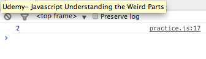

# JAVASCRIPT UNDERSTANDING THE WEIRD PARTS

# Section: 1 - Getting Started

## Conceptual Side
1. **Syntax Parsers:**
> A program that reads your code and determines what it does and if its grammar is valid

1. **Lexical Environments:**
> Where something sits physically in the code you write.

1. **Execution Contexts:**
> A Wrapper to help manage the code that is running.

1. **Name/ Value Pairs:**
> A name which maps to a unique value. The name may be defined more than once, but only can have one value in any given context.

  ``Address = '100 Main St``

1. **Object:**
> A collection of name value Pairs

1. **Javascript and 'Undefined':**
> A special value that Javascript has within it internally that means the variable has not been set. A key word that takes up memory.

  example:

  ```
  var a,
  console.log(a);
  ```

1. Single Threaded:
> One command at a time. Under the hood of the browser, maybe not.

1. Synchronous: (similar to Single Threaded)
> One at a time executes in the order that it appears.

# Section: 2 - Execution Contexts and Lexical Environments

## The Global Environment and the Global Object
- Two things are always created when execution context is created: **'Global object'** = window object when ran in the browser, **'variable = this'** which is equal to the global object.

*test out in console of browser. if you attach an empty js file to an html file, then type this in the console you will see a window object.*

**Global** = "not inside a function"
1. In Javascript when you are creating variables and functions where those variables are not inside of a function, they end up being attached to the global object.
1. **Outer Environment** is null at the global level.

## The Execution Context: Creation and 'Hoisting'
1. Hoisting Examples:

```
var a = "Hello World"

function b() {
  console.log('Called b!');
}
b();
console.log(a);
```

Results:


```
b();
console.log(a);
var a = "Hello World"

function b() {
  console.log('Called b!');
}
```

Results:


```
b();
console.log(a);

function b() {
  console.log('Called b!');
}
```

Results:


### What is Hoisting?
> Most languages read line by line... Javascript doesn't do that (as you can see in examples above for the function).

### *Note*
**ALL VARIABLES** in Javascript are initially set to **undefined**, and **FUNCTIONS ARE** sitting **in memory in their entirety**.

## Execution context is created in two phases:
1. **Creation Phase**
  - Global Object
  - 'this'
  - Outer Environment
  *Setup **Memory Space** for Variables and Functions 'Hoisting' it is not moving code to the top of the page*
1. **Execution Phase**
  - Runs code line by line, once the creation phase is complete.

### Function Invocation and The Execution Stack
>**Invocation:** running a function. In Javascript this is done using parenthesis ()

- Stack is created in this example:


### Functions, context, and Variable Environments
>**Variable Environments:** where the variables live and how they relate to each other in memory

Example:

Results:
[img](images/scopeChain2.png)
- Each of the myVars is sitting in its own execution context.

## The Scope Chain


Javascript does something special... it cares about the lexical environment when it comes to the outer reference that every execution context gets (*outer environment in creation phrase*). When you ask for a variable while running a line of code inside any particular execution context, if it can't find that variable it will look at the outer reference and go look for variables there. Somewhere down below it in the execution stack. And that outer reference where that points is going to depend on where the function sits **lexically**.   
Now this entire act of searching for references to **outer environments** is called **THE SCOPE CHAIN**

| EXAMPLE                        | RESULTS                        |
|:------------------------------:|:------------------------------:|
|       |       |
|       |       |
|       |       |

### Scope :
> where a variable is available in your code... and if it's truly the same variable, or a new copy

### ES6 (ECMAScript 6, ECMAScript 2015):
> **let** allows Javascript engine to use block scoping. Similar to **var**... more options of how to scope a variable with the new version of Javascript.

> blocks are within {}

## What about asynchronous callbacks?
- **asynchronous:** more than one at a time
- Although the Javascript Engine is synchronous, there are other engines within the browser that Javascript has hooks to them to make them asynchronous
- **Event Queue**: where all events are held, such as http request, click event, etc. This doesn't get looked at until the **stack** is empty.
- The event queue won't be processed until the execution stack is empty, until Javascript is done reading that code line by line. **So it isn't REALLY asynchronous.** What is happening is that the browser asynchronously is putting things into the event queue.

# Types and Operators
 ## Types and Javascript:
 ### **Dynamic Typing**: you don't tell the the engine what type of data a variable holds, it figures it out while your code is running. *(variables can hold different types of values because it's all figured out during execution)*

 Languages like Java or C#, they use something called **Static Typing** which means you tell the engine (compiler) ahead of time what kind of data you intend to hold inside a variable. Example: You might have a keyword like bool to say that this variable should hold a Boolean value, either true or false, and if you try to put a value that is other than a Boolean into that variable, you get an error... **JAVASCRIPT is NOT like that (Dynamic Typing)** You can change the bool to a string or number or whatever.

 ## Primitive Types - 6 total (type of data that represents a single value - not an object)
 - **Undefined** represents lack of existence (you shouldn't set a variable to this)
 - **Null** represents lack of existence (you can set a variable to this)
 - **Boolean** true or false
 - **Number** floating point number (there's always some decimals). Unlike other programming languages, there's only one 'number' type... and it can make math weird.
 - **String** a sequence of characters (bother ' and " can be used)
 - **Symbol** Used in ES6 (the next version of Javascript)

## Operators
- A special function that is syntactically (written) differently *Generally, operators take two parameters and return one result.*
- The operators are functions within Javascript
- **Infix Notation** the ability to write code as 3 + 4 vs +(3,4)... the addition side is inbetween the parameters. **Prefix notation** is + 3 4; and **Postfix notation** is 3 4+; (alot of old scholl calculators work this way)

**operators** + - > < * / % << >> >>> <= >= and soo many more...

## Operator Precedence and associativity
- **Operator Precendence** which operator function gets called first. Functions are called in order of precedence (higher precedence wins)
- **Associativity** what order operator functions get called in: left-to-right or right-to-left. When function have the same precedence

[Click here to see Operator Precedence]( https://developer.mozilla.org/en-US/docs/Web/JavaScript/Reference/Operators/Operator_Precedence.compiler)
